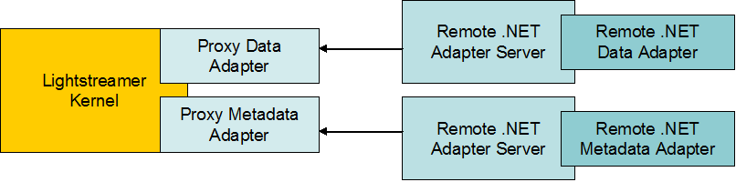

# Lightstreamer Portfolio Demo Adapter for .NET #

This project contains the source code and all the resources needed to install a .NET version of the Portfolio Data and Metadata Adapters.

## Dig the code ##
The application is divided into 5 main classes.

* <b>PortfolioDataAdapter.cs</b>: this is a C#/.NET porting of the [Portfolio Demo Data Adapter](https://github.com/Weswit/Lightstreamer-example-Portfolio-adapter-java). It inherits from the <i>IDataProvider</i> interface and calls back Lightstreamer through the IItemEventListener interface. Use it as a starting point to implement your custom data adapter in case of <b>COMMAND</b> mode subscription.<br>
* <b>LiteralBasedProvider.cs</b>: this is a C#/.NET porting of the [Portfolio Demo Metadata adapter](https://github.com/Weswit/Lightstreamer-example-Portfolio-adapter-java). It inherits from the <b>LiteralBasedProvider</b>, which is enough for all demo clients. In addition, it implements the NotifyUserMessage method, in order to handle <b>sendMessage</b> requests from the Portfolio Demo client. This allows the Portfolio Demo client to use <b>sendMessage</b> in order to submit buy/sell orders to the (simulated) portfolio feed used by the Portfolio Data Adapter.<br>
* <b>PortfolioFeed.cs</b>: used to receive data from the simulated portfolio feed in an asynchronous way.
* <b>NotificationQueue.cs</b>: used to provide an executor of tasks in a single dedicated thread.<br>
* <b>StandaloneAdaptersLauncher.cs</b>: this is a stand-alone executable that launches both the Data Adapter and the Metadata Adapter for the .NET Portfolio Demo example. It redirects sockets connections from Lightstreamer to the .NET Servers implemented in the DLL and does not rely on the .NET Server wrapper provided.<br>

Check out the sources for further explanations.

# Build #

If you want to skip the build process of this Adapter please note that in the [deploy release](https://github.com/Weswit/Lightstreamer-example-Portfolio-adapter-dotnet/releases) of this project you can find the "deploy.zip" file that contains a ready-made deployment resource for the Lightstreamer server.<br>
Otherwise to recompile the provided sources, you just need to create a project for a library target, name it "DotNetPortfolioDemo_N2", then include the sources ("src/src_adapters") and include references to the Lightstreamer .NET Adapter Server library binaries and Log4net library binaries (see DOCS-SDKs/sdk_adapter_dotnet/lib/ folder of your Lighstreamer home).<br>

## Build the Stand-alone launcher ##
To recompile the provided source, you just need to create a project for a console application target, name it "DotNetPortfolioDemoLauncher_N2", then include the source (StandaloneAdaptersLauncher.cs) and include references to the Lightstreamer .NET Adapter Server library binaries (see above), the Log4net library binaries (see
above) and .NET Portfolio Demo Data Adapter binaries you have got from the above source code. Make sure that the entry point of the executable is the ServerMain class.

# Deploy #



To test the .NET Adapter follow this simple process below.
The instructions provided refer to the "Deployment" directory you can find in the "deploy.zip" file of [latest release](https://github.com/Weswit/Lightstreamer-example-Portfolio-adapter-dotnet/releases).

1. Make sure you have a working installation of [Lightstreamer Portfolio Demo](https://github.com/Weswit/Lightstreamer-example-Portfolio-client-javascript).
2. Make sure that Lightstreamer Server is not running.
3. Plug the new Adapter Set into the Server. Just copy the "DotNetPortfolio" directory and all of its files to the "adapters" subdirectory in your Lightstreamer Server installation.<br>
4. Launch the Remote .NET Adapter Server. The .NET Server resources can be found under Deployment_DotNet_Server(custom). Run the DotNetCustomServer.bat script under the "Deployment_DotNet_Server(custom)" Directory. The script runs the DotNetPortfolioDemoLauncher_N2.exe Custom Launcher, which hosts both the Remote Data Adapter and the Remote Metadata Adapter for the .NET Portfolio Demo.
5. Lightstreamer Server is now ready to be relaunched. The Server startup will complete only after a successful connection between the Proxy Adapters and the Remote Adapters.
6. Please test your Adapter with one of the front-end pages in this [list](https://github.com/Weswit/Lightstreamer-example-Portfolio-adapter-dotnet#clients-using-this-adapter).

<i>NOTE: In order to make the Portfolio front-end pages consult the newly installed Adapter Set, you need to modify the front-end pages and set the required Adapter Set name to PORTFOLIODEMO_REMOTE when creating the LightstreamerClient instance.
So a line like this:
```js
  var sharingClient = new LightstreamerClient(hostToUse,"DEMO");
```
becomes like this:
```js
  var sharingClient = new LightstreamerClient(hostToUse, "PORTFOLIODEMO_REMOTE");
```
(you don't need to reconfigure the Data Adapter name, as it is the same in both Adapter Sets).

Moreover, as the referred Adapter Set has changed, make sure that the front-end does no longer share the Engine with demos.
So a line like this:
```js
  sharingClient.connectionSharing.enableSharing("DemoCommonConnection","ls/","SHARE_SESSION", true);
```
should become like this:
```js
  sharingClient.connectionSharing.enableSharing("RemotePortfolioConnection","ls/","SHARE_SESSION", true);
```
The Portfolio web front-end is now ready to be opened. The front-end will now get data from the newly installed Adapter Set.</i>

<i>Please note that to run the Portfolio Demo client with full functionalities, your Lightstreamer server installation must have deployed both this adapter and the [Lightstreamer StockList Demo Adapter for .NET](https://github.com/Weswit/Lightstreamer-example-StockList-adapter-dotnet). In the deploy.zip  file of the [latest release](https://github.com/Weswit/Lightstreamer-example-Portfolio-adapter-dotnet/releases) you can find "Full_Deployment_DotNet_Server" and "Full_Deployment_LS" folders, which contain an example of a combined deployment of the two Adapters.</i>

You can refer to Deployment_DotNet_Server(custom)\DotNetCustomServer.bat as an example on how to start the .NET Server manually.
In case of need, the .NET Server prints on the log a help page if run with the following syntax: "DotNetServer /help".

Please note that the .NET Server connects to Proxy Adapters, not vice versa.

Please refer to the [LS DotNet Adapters.pdf](http://www.lightstreamer.com/latest/Lightstreamer_Allegro-Presto-Vivace_5_1_Colosseo/Lightstreamer/DOCS-SDKs/sdk_adapter_dotnet/doc/DotNet%20Adapters.pdf) document for further deployment details.<br>
The standard type of configuration is shown, where the process which runs the Remote Adapters is manually launched beside Lightstreamer Server.
On the other hand, two different examples of manual launch of the remote process are shown, one based on the provided Remote Server and one based on a custom server program, also shown.
  
# See Also #

## Clients using this Adapter ##
* [Lightstreamer Portfolio Demo Client for JavaScript](https://github.com/Weswit/Lightstreamer-example-Portfolio-client-javascript)
* [Lightstreamer Portfolio Demo Client for Adobe Flex SDK](https://github.com/Weswit/Lightstreamer-example-Portfolio-client-flex)
* [Lightstreamer Portfolio Demo Client for Dojo](https://github.com/Weswit/Lightstreamer-example-Portfolio-client-dojo)

## Related projects ##
* [Lightstreamer Portfolio Demo Adapter](https://github.com/Weswit/Lightstreamer-example-Portfolio-adapter-java)
* [Lightstreamer StockList Demo Adapter for .NET](https://github.com/Weswit/Lightstreamer-example-StockList-adapter-dotnet)

# Lightstreamer Compatibility Notes #

- Compatible with Lightstreamer SDK for .NET Adapters since 1.7